# PBL02 - Embedded Monitoring and Alarm System (Finite State Machine)

## 📋 Overview 

This project was developed for the **PBL02 Embedded Systems** course at **UNIFEI**.  
It implements an embedded monitoring and alarm system on the **LPC11Uxx** microcontroller, simulating a configurable smart sensor.

The system uses:
- A **finite state machine** to navigate between configuration modes  
- An **LCD** and buttons for user interaction  
- **UART** for receiving external sensor values  
- An **RTC** for timestamped alarms  
- A **multilingual interface** (Portuguese/English)

---

## 🎥 Demo
[🎬 Watch the project demo](https://youtu.be/uE-_c5lZllQ)

---

## 🎯 Project Goals

- Implement a robust finite state machine for an embedded system  
- Create a configurable alarm system with minimum and maximum thresholds  
- Develop an intuitive user interface using LCD and buttons  
- Receive external sensor data via serial communication  
- Integrate an RTC (Real Time Clock) for time-based features  
- Provide a bilingual interface (Portuguese/English)

---

## 🔧 Hardware

### Microcontroller

- **LPC11Uxx** (ARM Cortex-M0)  
- 48 MHz clock  
- I2C, UART, ADC, GPIO

### Peripherals

- **16x2 LCD** (4-bit interface)  
- **RTC MCP7940** (I2C)  
- **5 Buttons** (UP, DOWN, LEFT, RIGHT, CONFIRM)  
- **4 Status LEDs**  
- **UART** at 9600 baud

### 🔌 I/O Summary

| Category             | Signal / Group        | MCU Pins                          | Direction      | Notes                              |
|----------------------|-----------------------|-----------------------------------|----------------|------------------------------------|
| Status LEDs          | LED0–LED3             | PIO2_9, PIO3_0, PIO2_0, PIO2_6    | Output         | Visual alarm / status indication  |
| User Buttons         | UP, RIGHT, DOWN, LEFT, CONFIRM | PIO2_8, PIO2_1, PIO0_2, PIO1_8, PIO2_7 | Input          | Navigation and configuration      |
| LCD Control/Data     | RS, E, D4–D7          | PIO1_1, PIO1_0, PIO0_11, PIO2_11, PIO1_10, PIO0_9 | Output | 16x2 character LCD (4-bit mode)   |
| I²C (RTC)            | SDA, SCL              | PIO0_5, PIO0_4                    | Bidirectional  | Communication with MCP7940 RTC    |
| Serial (UART)        | TX, RX                | (Configured UART pins on LPC11Uxx)| TX/RX          | External sensor value monitoring  |

### 📍 Detailed Pinout

```text
LEDs (Outputs)
- LED0: PIO2_9
- LED1: PIO3_0
- LED2: PIO2_0
- LED3: PIO2_6

Buttons (Inputs)
- UP:      PIO2_8
- RIGHT:   PIO2_1
- DOWN:    PIO0_2
- LEFT:    PIO1_8
- CONFIRM: PIO2_7

LCD 16x2 (4-bit mode, Outputs)
- RS:  PIO1_1
- E:   PIO1_0
- D4:  PIO0_11
- D5:  PIO2_11
- D6:  PIO1_10
- D7:  PIO0_9

I²C – RTC MCP7940
- SDA: PIO0_5
- SCL: PIO0_4

UART – Serial Interface
- TX, RX: configured according to the LPC11Uxx UART pins (9600 baud)
```

## 🏗️ System Architecture

### Finite State Machine

The system is organized as a finite state machine with four main states:

1. **STATE_TEMPO** – Current time configuration  
2. **STATE_IDIOMA** – Language selection (Portuguese/English)  
3. **STATE_ALARME_MIN** – Minimum alarm threshold configuration  
4. **STATE_ALARME_MAX** – Maximum alarm threshold configuration  



### System Events

```c
enum {
    EV_UP,      // UP button pressed
    EV_DOWN,    // DOWN button pressed
    EV_LEFT,    // LEFT button pressed
    EV_RIGHT,   // RIGHT button pressed
    EV_ENTER,   // CONFIRM button pressed
    EV_NOEVENT  // No event
};
```
---

## 📁 Code Estructure 

### Main Modules

```
src/
├── main.c              // Main program and monitoring loop
├── stateMachine.c/h    // Finite state machine implementation
├── event.c/h           // Event system and button debounce
├── var.c/h             // Global variables and shared state
├── output.c/h          // LCD output interface
├── buttons.c/h         // Button handling
├── lcd.c/h             // LCD driver
├── leds.c/h            // LED control
├── i2c.c/h             // I2C communication
├── rtc.c/h             // RTC MCP7940 interface
├── serial.c/h          // UART serial communication
├── adc.c/h             // Analog-to-digital converter
├── io.c/h              // I/O abstraction layer
└── utils.c/h           // Utility functions
```

### Design Choices

From the beginning of the project, we defined a **modular software architecture** as a design directive, separating the system into dedicated modules for the state machine, event handling, UI and hardware drivers (LCD, RTC, UART, GPIO). This structure improves maintainability and readability, allows reuse of drivers in future embedded projects, and makes it easier to adapt the application to other microcontrollers with minimal changes.

---

### Implemented Abstractions

1. **I/O Abstraction Layer** – Unified interface for GPIO pins and peripherals  
2. **Event System** – Asynchronous button event handling with software debounce  
3. **State Management** – Centralized finite state machine controlling the application flow  
4. **User Interface Layer** – LCD screens and messages with multi-language support (PT/EN)  
5. **Communication Drivers** – Modular drivers for I2C (RTC), UART (serial input) and LCD  

---

## 🔄 System Behavior

### Main Flow

1. **Initialization** – The system starts in the *Time* configuration state.  
2. **Navigation** – The user navigates between states using the CONFIRM button.  
3. **Configuration** – LEFT/RIGHT buttons adjust time, language and alarm thresholds.  
4. **Monitoring** – The system continuously reads sensor values via UART.  
5. **Alarm Handling** – Incoming values are compared against the configured thresholds.

### Alarm System

The system monitors values received over UART and compares them against the configured thresholds:

- **Value < Minimum threshold** → Alarm triggered, LED0 ON  
- **Value > Maximum threshold** → Alarm triggered, LED1 ON  
- **Value within range** → No alarm  

Alarm message format:

```text
WARNING - Value [value] is outside the range [min, max]
[timestamp]
```

### User Interface

#### Time State (STATE_TEMPO)
- **Display (line 1):** "Change time"
- **Display (line 2):** HH:MM:SS
- **Controls:** LEFT/RIGHT adjust minutes

#### Language State (STATE_IDIOMA)
- **Display (line 1):** "Change language"
- **Display (line 2):** "Português" / "English"
- **Controls:** LEFT/RIGHT switch language

#### Min Threshold State (STATE_ALARME_MIN)
- **Display (line 1):** "Min Threshold:"
- **Display (line 2):** Numeric value
- **Controls:** LEFT/RIGHT adjust minimum threshold

#### Max Threshold State (STATE_ALARME_MAX)
- **Display (line 1):** "Max Threshold:"
- **Display (line 2):** Numeric value
- **Controls:** LEFT/RIGHT adjust maximum threshold

## 🛠️ Implemented Features

### ✅ Basic Features
- [x] Finite state machine with 4 main states
- [x] 16x2 LCD user interface
- [x] Button system with software debounce
- [x] Status LEDs
- [x] Serial communication (9600 baud)
- [x] RTC integration over I²C (MCP7940)

### ✅ Advanced Features
- [x] Multilingual system (PT/EN)
- [x] Continuous serial monitoring
- [x] Configurable alarm system (min/max thresholds)
- [x] Timestamped alarms
- [x] Button debounce
- [x] BCD ↔ decimal conversions for the RTC
- [x] Hardware abstraction layer

### Serial Usage Example

```text
> 75
[System checks whether the value is within [min, max]]

> 150
WARNING - Value 150 is outside the range [50, 100]
16:55:25 04/07/2025

> 25
WARNING - Value 25 is outside the range [50, 100]
16:55:30 04/07/2025
```

## 📊 Project Highlights

### 1. **Arquitetura Robusta**
- Máquina de estados bem estruturada
- Modularização clara e reutilizável
- Abstração eficiente de hardware

### 2. **Interface Intuitiva**
- LCD claro e informativo
- Navegação lógica entre estados
- Feedback visual com LEDs

### 3. **Funcionalidades Avançadas**
- Sistema multilíngue
- Timestamp em alarmes
- Thresholds configuráveis
- Monitoramento contínuo

### 4. **Qualidade de Código**
- Comentários descritivos
- Estrutura modular
- Tratamento de casos especiais
- Debounce implementado

### 5. **Integração de Hardware**
- Múltiplos periféricos integrados
- Comunicação I2C e UART
- Controle preciso de GPIO

## 🔮 Possíveis Melhorias

- [ ] Implementar menu de configuração avançada
- [ ] Adicionar mais sensores (temperatura, umidade)
- [ ] Implementar log de eventos na SRAM do RTC
- [ ] Adicionar comunicação Bluetooth/WiFi
- [ ] Implementar sistema de usuários
- [ ] Adicionar mais idiomas
- [ ] Implementar gráficos no LCD

## 👥 Equipe

**Grupo 06 - PBL02 - UNIFEI**

---

**Disciplina**: PBL02 - Sistemas Embarcados
**Instituição**: UNIFEI - Universidade Federal de Itajubá
**Ano**: 2025

---

*Este projeto representa a integração de conhecimentos em sistemas embarcados, programação em C, e desenvolvimento de hardware, demonstrando a aplicação prática de conceitos teóricos em um sistema funcional completo.*
